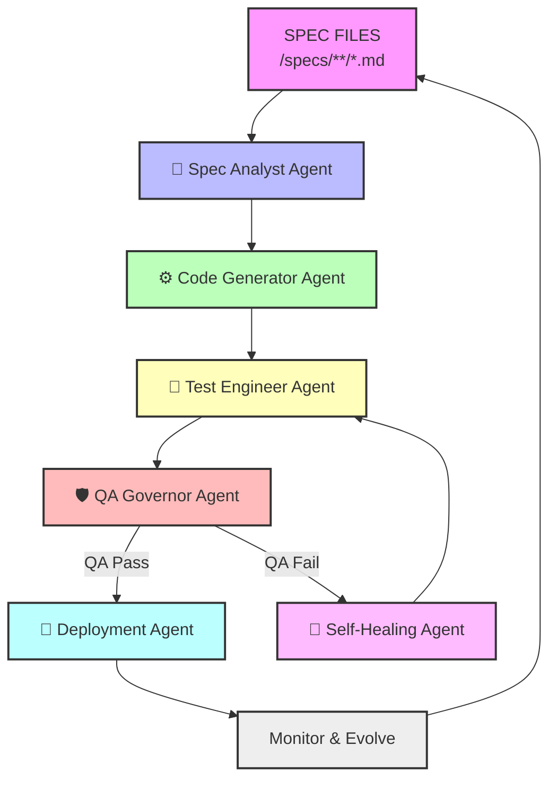

# 🧠🔥 ¿QUÉ ES guido-agentic-pipeline?

👉 No es un framework
👉 No es un agente

👉 Es esto:

---

## 🔗 Referencias de patrones y agentes

Los agentes de este pipeline siguen los patrones y convenciones definidos en:

- [guido-sdd-engineering-stack](https://github.com/GuiMiran/guido-sdd-engineering-stack)
- [spectra](https://github.com/GuiMiran/spectra)

Consulta esos repos para detalles de arquitectura, taxonomía de agentes, y principios SDD/SPECTRA.

## 🧩 EL MOTOR DE EJECUCIÓN DE TU SISTEMA

---

## 🗺️ Arquitectura Multi-Agente GUIDO SDD



### 🧠 PIÉNSALO ASÍ (CLARIDAD TOTAL)

Tú tienes 3 piezas:

1. **SPECTRA**
   → Define el conocimiento (QUÉ)
2. **GUIDO STACK**
   → Define cómo se ejecuta (CÓMO)
3. **guido-agentic-pipeline**
   → Hace que todo ocurra (QUIÉN / CUÁNDO / LOOP)

---

## ⚙️🔥 QUÉ HACE REALMENTE

Tu pipeline agentic hace esto:

**INPUT:** SPEC (SPECTRA)

        ↓

[PIPELINE]

1. ANALYZE
2. PLAN
3. BUILD
4. TEST
5. VALIDATE
6. DEPLOY
7. MONITOR
8. FIX (SELF-HEAL)

        ↓

**OUTPUT:** SISTEMA FUNCIONANDO

---

## 🧠 ESTO ES CLAVE (MUY CLAVE)

Esto encaja EXACTAMENTE con cómo funcionan los pipelines agentic reales:

👉 sistemas que:
- planifican
- descubren
- ejecutan
- usan herramientas
- corrigen errores en bucle

---

## 🔥 TU PIPELINE ES ESTO (REINTERPRETADO EN GUIDO)

```
┌─────────────────────────────┐
│        SPEC (SPECTRA)       │
└────────────┬────────────────┘
             ▼
┌─────────────────────────────┐
│ 🧠 Spec Analyzer Agent      │
└────────────┬────────────────┘
             ▼
┌─────────────────────────────┐
│ 🧩 Planner Agent            │
└────────────┬────────────────┘
             ▼
┌─────────────────────────────┐
│ ⚙️ Builder Agent            │
└────────────┬────────────────┘
             ▼
┌─────────────────────────────┐
│ 🧪 Test Agent               │
└────────────┬────────────────┘
             ▼
┌─────────────────────────────┐
│ 🛡 QA Governor              │
└────────────┬────────────────┘
             ▼
┌─────────────────────────────┐
│ 🚀 Deploy Agent             │
└────────────┬────────────────┘
             ▼
┌─────────────────────────────┐
│ 🔁 Self-Healing Agent       │
└─────────────────────────────┘
```

---

## 🧠🧩 DIFERENCIA CRÍTICA (QUE AHORA ENTIENDES)

👉 SIN pipeline:
- tienes agentes sueltos
- caos
- sin orden
- sin autonomía real

👉 CON pipeline (guido-agentic-pipeline):
- tienes flujo
- tienes orden
- tienes loop autónomo
- tienes sistema vivo

---

## ⚠️ POR ESO TE SENTÍAS PERDIDO

Porque estabas intentando esto:

❌ agentes → código → magia

Pero en realidad necesitas esto:

**SPEC → PIPELINE → AGENTES → SISTEMA**

---

## 🔥 LO MÁS IMPORTANTE

Tu repo no es opcional.

👉 Es **EL CORE** de tu sistema.

---

## 🧠🧩 CÓMO USARLO (CLARO Y DIRECTO)

### 👉 1. NO lo ejecutes solo
No es un programa tipo:

    npm start

Es un patrón / arquitectura / orquestador

### 👉 2. Lo usas dentro de tu runtime

Tu estructura final debe ser:

```
guido-autonomous-runtime/
  /specs
  /src
  /tests
  /agents
    spec.agent.md
    builder.agent.md
    test.agent.md
    qa.agent.md
    healer.agent.md
   /agents
      orchestrator.agent.md
      spectra-curator.agent.md
      guido-planner.agent.md
      builder.agent.md
      test-engineer.agent.md
      qa-governor.agent.md
      self-healer.agent.md
  /pipeline
    guido-agentic-pipeline.md  ← ESTE
  .vscode/mcp.json
```

---

## 🧩 Agentes base (no repetidos)

El sistema define 6 agentes base, alineados a GUIDO SDD:

- orchestrator
- spectra-curator
- guido-planner
- builder
- test-engineer
- qa-governor
- self-healer

Cada uno tiene su .agent.md en /agents y cumple un rol específico en el pipeline agentic.

### 👉 3. El pipeline define el flujo

Ejemplo real:

WHEN:
  spec changes
THEN:
  run pipeline

PIPELINE:
1. spectra-curator
2. guido-planner
3. builder
4. test-engineer
5. qa-governor

IF FAIL:
  → self-healer
IF PASS:
  → deploy

---

## 🔁🔥 LA PIEZA MÁS IMPORTANTE
### 👉 SELF-HEAL LOOP

Esto es lo que convierte tu sistema en “vivo”:

RUN TESTS
   ↓
FAIL?
   ↓ YES
ANALYZE
   ↓
FIX
   ↓
RE-RUN
   ↓
STABLE?

Esto no es teoría:
👉 es exactamente el patrón “run → review → fix” que usan pipelines agentic modernos

---

## 🧠🔥 RESUMEN CLARO (QUÉ ES TU REPO)

👉 guido-agentic-pipeline es:
- ✔ El cerebro operativo
- ✔ El flujo de ejecución
- ✔ El loop autónomo
- ✔ El runtime lógico de GUIDO

---

## 🚀 TU SISTEMA COMPLETO (YA CLARO)
- SPECTRA → define realidad
- GUIDO → define reglas
- PIPELINE → ejecuta
- AGENTES → trabajan
- MCP → conecta herramientas
- QA GOVERNOR → decide
- SELF-HEALER → corrige

---

## 💣 CONCLUSIÓN (IMPORTANTE)

Ahora sí estás viendo todo:

👉 Antes: piezas sueltas
👉 Ahora: sistema completo

---

## 🚀 SIGUIENTE PASO (TE RECOMIENDO)

Si quieres lo bajamos a tierra 100% real:

👉 te construyo:
- el guido-autonomous-runtime completo
- con: agents reales
- pipeline ejecutable
- mcp.json
- integración Azure DevOps + Selenium + Newman
